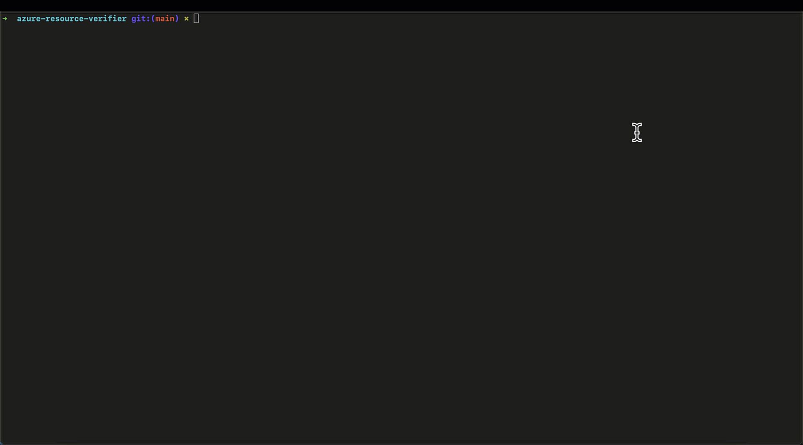

# Azure Resource Verifier

This tool is used to verify Azure resources can be deployed to a region in a subscription. It is intended to be used as a pre-deployment check.

---

**Disclaimers:**

This tool is under active development.

* The commands and flags of this tool is not yet stable. Expect significant changes in minor
  versions before `v1.0.0`.
* This tool is not yet recommended for production use. It is currently in the experimental phase.
---

## Features

The following features are supported:

- Get a list of regions that are available in a subscription
- Verify that Azure Cache for Redis can be deployed to a region
- Verify that Azure Database for PostgreSQL Flexible Server can be deployed to a region
- Verify that Azure App Service can be deployed to a region

## Install

There are many ways to get started with the *Azure Resource Verifier*.

- **go install**

  **(Option 1)** Install *Azure Resource Verifier* using the `go install` command.

  ```
  go install github.com/nickdala/azure-resource-verifier@latest
  ```

  This will install the *Azure Resource Verifier* in your `$GOPATH/bin` directory.

- **Build from Source**

  **(Option 2)** Build the *Azure Resource Verifier* from source. Clone the repository and build the binary.

  ```
  git clone https://github.com/nickdala/azure-resource-verifier.git

  cd azure-resource-verifier

  go build
  ```

  The binary *azure-resource-verifier* will be created in the current directory.

- **DevContainer**

  **(Option 3)** There is a [DevContainer](https://code.visualstudio.com/docs/remote/containers) that can be used to build the project in a container. This is useful if you don't have Go installed on your machine.
  You can open the project in Visual Studio Code and select the "Reopen in Container" option. Or you can use [CodeSpaces](https://github.com/features/codespaces) to build the project in the cloud.

  

## Running Azure Resource Verifier

You must first be authenticated to Azure and have the appropriate subscription selected. Install the [Azure CLI](https://learn.microsoft.com/en-us/cli/azure/install-azure-cli) and run the following command to authenticate:

```
az login
```

If you have multiple tenants, you can use the following command to log into the tenant:

```
az login --tenant <tenant-id>
```

Once logged in, you can issue the following commands.

### Quickstart

The `quickstart` command guides you through the verification of Azure Cache for Redis, Azure Database for PostgreSQL Flexible Server, and Azure App Service in the specified locations.

```
./azure-resource-verifier quickstart -s <subscription-id> -l <location>
```

For example:

```
./azure-resource-verifier quickstart -s 00000000-0000-0000-0000-000000000000 -l eastus2 -l westus3
```

Or you can specify the `--all-locations` flag to verify all locations.

```
./azure-resource-verifier quickstart -s <subscription-id> --all-locations
```

### list-locations

List all locations in a subscription.

```
./azure-resource-verifier list-locations -s <subscription-id>
```

### redis

Verify Azure Cache for Redis can be deployed to a region.

```
./azure-resource-verifier redis -s <subscription-id> -l <location> -l <location>
```

Or

```
./azure-resource-verifier redis -s <subscription-id> --all-locations
```

For example:

```
./azure-resource-verifier redis -s 00000000-0000-0000-0000-000000000000 -l eastus2 -l westus3
```

### postgresql

Verify Azure Database for PostgreSQL Flexible Server can be deployed to a region.

```
./azure-resource-verifier postgresql -s <subscription-id> -l <location> -l <location>
```

Or

```
./azure-resource-verifier postgresql -s <subscription-id> --all-locations
```

For example:

```
./azure-resource-verifier postgresql -s 00000000-0000-0000-0000-000000000000 -l eastus2 -l westus3
```

### web-app

Verify Azure App Service can be deployed to a region.

```
./azure-resource-verifier web-app -s <subscription-id> -o linux -p container -l <location> -l <location>
```

### help

Get help for any command.

```
./azure-resource-verifier help
```

## Demo


